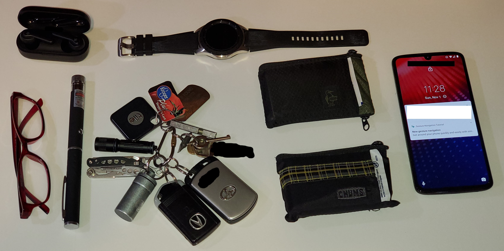

# Everyday Carry (EDC) Essentials 2020 -- [Tech Notes](..) -- [Steve Schmidt](/)
Some notes about the gear that I carried everyday in 2020 along with some key everyday carry and general travel prep concepts.
Originally posted as a long [Twitter thread](https://x.com/czmyt/status/1322948156238299143) in November 2020.
Edited for clarity and reorganized into strict outline format.

I used to travel 10-15 times a year when it was safe to travel.
Mostly multi-day air travel with a few road trips.
One of my hobbies is travel prep.
I reached a level of preparedness about three years ago in which I'm seldom w/o something I need.

Jump to:
    §&nbsp;[Key EDC Concepts](#concepts),
    §&nbsp;[List of EDC Essentials](#list),
    §&nbsp;[Pictures of EDC Essentials](#pictures).

## Key Everyday Carry Concepts

- Key everyday carry (EDC) concepts for me:
    - Redundancy (where possible)
    - Evolution (always getting getter)
    - Testing (test all your gear)
    - Compactness (lightweight and compact)
    - Multipurpose (more on that later)
- My two best best travel preparation tips:
    - If you can afford it, have a completely different set of gear that is exclusively for travel: Computers, gear, clothes, everything.
    - Never pack before your trips; always re-pack and re-stock after your last trip.
- My travel gear is broken down into:
    - my day-pack,
    - my carry-on pack,
    - my checked luggage, and
    - my road-trip vehicle pack.
- All travel gear is modular and further organized.
    - See my [Travel Tips](/travel-tips) page for more info.

## List of Everyday Carry Essentials

Always on my person when I leave the property:
- **keychain**
    - **car keys**
    - **handcuff key**
    - **other keys**
    - **titanium pea-less whistle**
    - **titanium bit**
    - **ID tag with "Reward If Found" offer**
    - **Kroger card w/drop in mail offer**
    - **Tile locator**
    - **flashlight**
    - **Leatherman PS multitool**
         The Leatherman PS is TSA-compliant, meaning that it can be carried inside passenger airplane cabins.
        Sometimes I carry a knife or multi-tool that has cutting blades and saws.
        Depends on the situation.
        I like my Victorinox Swisstool, SOG multitools, and Victorinox Swiss Army knives the most.
    - **pill container**
         Contains various over-the-counter (OTC) medications including:
        - **pain relievers** (Ibuprofen & Acetaminophen)
        - **anti-allergic reaction / sleeping pills** (Diphenhydramine)
        - **anti-nausea** (Dimenhydrinate & Meclizine)
        - **anti-diarrhea** (Loperamide)
        - **caffeine pills**
- **two wallets**
     Each wallet has at least:
    - **one form of ID**
         Enhanced driver license in one, US passport card in other.
    - **credit card**
         The credit cards are from different banks.
    - **debit card**
         The debit cards are from different accounts.
        Debit Cards are from the same bank for now, but I should change that.
    - **currency**
         At least US$300 in each.
    - **cleansing wipes**
    - one wallet has:
        - **critical first aid items**
        - **a pen**
        - **USB C wired earbuds**
- **two smartphones**
    - I took the above pictures with the smartphone that I always carry.
        The one pictured is my backup.
    - They are different brands, different technology (one is CDMA, one is GSM), different major carriers, both unlocked, both Android.
        One cellphone and the smartwatch are IPX8 waterproof.
        Two cellphones are not waterproof.
    - The SIM cards can be interchanged and used very soon after switching with no carrier interaction required (boo Sprint for requiring reactivation after moving cards).
- **smartwatch**
    - The smartwatch from Samsung has cellular voice and data.
    - The voice phone # on the smartwatch is the same as my main phone #, as is another small cellphone that I have.
        All three ring when I receive incoming calls.
- **active noise-cancelling (ANC) Bluetooth earbuds**
- **reading glasses**
- **laser pointer**
    - The laser pointer has a filter that disperses the light, so I think it makes a good defensive weapon.
        Much more stunning I think than any bright flashlights that simply flash.
    - The laser pointer filter unscrews then laser pointer produces a single focused beam, which is good for signalling for help if I ever need to.
        Haven't yet fortunately!
        Am thinking of gluing the filter onto the pointer so I will never be accused of pointing it at aircraft.
    - I use good alkaline batteries in the laser pointers because I want them to work when I finally need them.
        I use rechargeable batteries in everything else.

## Pictures of Everyday Carry Essentions

Most of my everyday carry essentials:

Main smartphone not pictured.

My keychain:

Key teeth blacked out.

My everyday carry essentials, illuminated with the laser pointer:

Main smartphone not pictured.

© 2020-2025 Stephen Schmidt.  All rights reserved.  [Terms and Conditions](/terms-and-conditions) incorporated herein.
